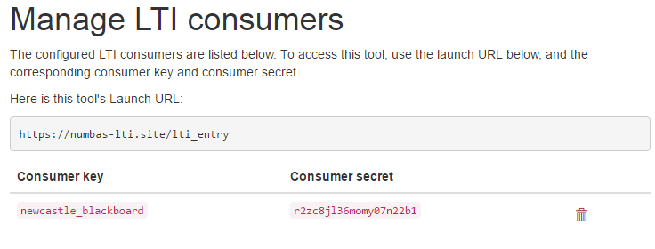

# LTI tool provider

This is a Basic LTI 1.1 tool provider, to run [Numbas](http://www.numbas.org.uk) exams in any LTI-compatible virtual learning environment.

The tool handles attempt data, and as well as offering CSV exports of student scores can report scores back to the host VLE's gradebook.

## What do I need in order to use this?

You must run your own instance of this tool - as well as using a fair amount of server resources, we don't want to keep other people's student data!

To install the tool, you need:

* A dedicated server to install the software on, which will communicate with your virtual learning environment. At Newcastle, we use servers running Ubuntu. 
* The ability to add a link to an LTI tool to your virtual learning environment. In Blackboard and Moodle, only administrators can do this.

At most institutions, this will require the help of your IT team.

If you're unsure whether you can use the LTI tool provider, or want help setting it up, [email the Numbas team](mailto:numbas@ncl.ac.uk).

## How to use

The set-up process looks like this:

* Install the software on your own server, or on the cloud platform Heroku.
* Complete the initial set-up, creating an admin account and an LTI consumer key.
* Add the LTI tool to your VLE using the details provided.
* When you access the tool from your VLE, upload a Numbas SCORM package, and you're done!

## Installing the software

Below are instructions on installing the software on your own server, or on virtual machines provided by Heroku or the virtualisation software Vagrant.

### On your own server

This method is the most appropriate for real-world use, i.e. not development or testing.

At the moment we have instructions on install the software on a machine [running Ubuntu 16.04 and using Apache](doc/install_apache.md).

### In the cloud with Heroku

The quickest way of setting up the software is through Heroku. Click on the button - it'll take about five minutes from start to finish.

Heroku gives you 1,000 free hours of uptime per month, and limits the size of your app's database. To keep the app running continuously, and store more data, you have to pay. The minimum "always-up" setup looks to cost around $30 per month, though use with real students might require more resources than that.

### In a Vagrant virtual machine

[Vagrant](https://www.vagrantup.com/) provides an easy way of managing virtual machines on your computer. You might want to use this if you're trying out the software on a Windows PC, or want to run the tool in a self-contained environment, separate from your other software.

* [Vagrant set-up instructions](doc/vagrant.md)

## Complete the set-up

Open the tool's homepage in your browser. You'll be guided through the process of setting up an admin account and adding a consumer key to the database.

Once that's done, you'll see something like the following:

That page shows the three pieces of information you need to give to your VLE: 

* **Automatic configuration URL** (or **Launch URL** if your VLE doesn't support automatic configuration)
* **Consumer key**
* **Shared secret**

## Add the tool to your VLE

The final step is to create a link between your VLE and the tool provider.

### With Blackboard

Follow [Blackboard's instructions](https://en-us.help.blackboard.com/Learn/Administrator/SaaS/Integrations/Learning_Tools_Interoperability) - you'll need to add Numbas a new LTI Tool provider, and then add a placement for it. 

Blackboard doesn't support automatic configuration by URL, so you'll have to use the manual configuration settings.

For the tool provider:

* The **Provider domain** is your launch URL.
* The **Tool provider key** is your consumer key.
* The **Tool provider secret** is your shared secret.

For the placement:

* The **Label** is "Numbas" (or whatever you want it to be)
* The **Type** is "Content Type", and select "Assessments" in the menu.
* Tick **Placement allows grading**.
* Save the icon from your "Manage consumers" page and upload it undr the **Icon** field on the Blackboard form.

You can now add a Numbas exam to any folder in Blackboard by selecting "Numbas" from the *Assignments* menu.

### With Moodle

Moodle from version 3.0 onwards supports LTI configuration by URL. Earlier versions require you to enter the configuration settings manually.

If you have administrator privileges on Moodle, you can add the tool as an activity type, so you don't have to enter the settings for each exam.

#### Moodle 3.0+

* Go to Site administration -> Plugins -> Activity modules -> External tool -> Manage tools.
* Paste your **automatic configuration URL** into the box labelled "Tool URL", and click "Add".
* Enter your **consumer key** and **shared secret**, then click "*Save changes*".

Now you can add a Numbas exam in any course by clicking "Add an activity or resource" and selecting "External tool", then select "Numbas" from the "Preconfigured tool" dropdown.

If you'd like Numbas to show up as an activity type, bypassing the "External tool" step:

* Go back to the *Manage tools* page and edit the Numbas tool. 
* For **Tool configuration usage**, select "Show in activity chooser and as a preconfigured tool".

#### Versions of Moodle before 3.0

* Go to Site administration -> Plugins -> Activity modules -> External tool -> Manage tools.
* Click on "configure a tool manually".
* Set **Tool name** to "Numbas".
* The **Tool base URL** is your launch URL.
* The **Consumer key** is your consumer key.
* The **Shared secret** is your shared secret.
* Under *Tool configuration usage*, select "Show in activity chooser and as a preconfigured tool".

Now you can add a Numbas exam in any course by clicking "Add an activity or resource" and selecting "Numbas".

### With Canvas LMS

* Go to your course's *Settings* page, then click on *Apps* and *View App Configurations*.
* Click the button to add an App.
* For **Configuration type**, select "By URL".
* The **Consumer key** is your consumer key.
* The **Shared secret** is your shared secret.
* The **Config URL** is your automatic configuration URL.

Now you can add a Numbas exam in your *Modules* page:

* Click the button to add an item.
* Select "External tool" and click on "Numbas".
* Click "Add item".
