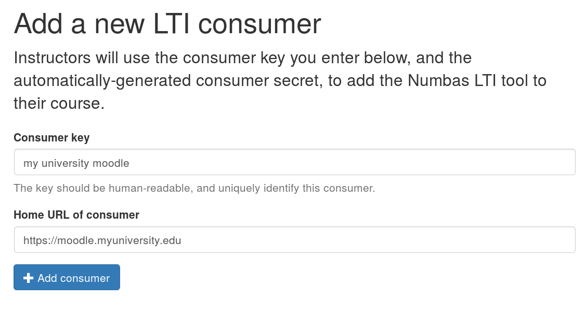
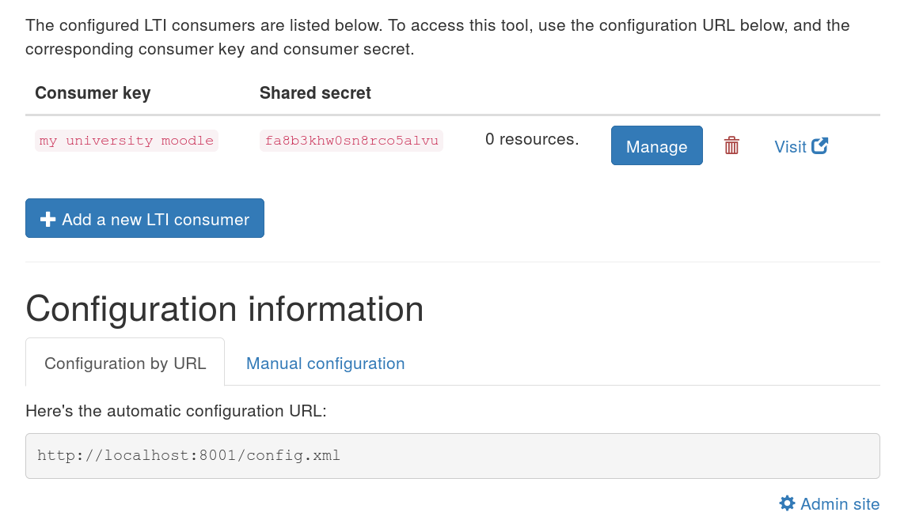

.. _consumer:

Consumers
#########

A *tool consumer* is an application which sends users to the Numbas LTI provider, and receives score data in return.
In most cases, this will be a Virtual Learning Environment (VLE), such as Blackboard, Canvas or Moodle.

Only admin users on the LTI provider can create and manage consumers.

.. _add-consumer:

Adding a consumer
-----------------

The first step is to add a consumer.
Click the :guilabel:`Add a new LTI consumer` button.

You will be asked to give a unique _key_ to identify the consumer, and optionally the URL of the consumer's homepage.
The key can be any text, but should uniquely identify the consumer and its purpose.

    The "Add a consumer" screen.

Once you have created a consumer, you are shown its *key* and *shared secret*.
These are the pieces of information that the consumer will use to establish a secure connection with the Numbas LTI provider.

    The consumer management screen.

You must now set up the connection from the consumer's end.
There are instructions for some of the most popular VLEs below.

Blackboard Learn
****************

Follow `Blackboard's instructions <https://en-us.help.blackboard.com/Learn/Administrator/SaaS/Integrations/Learning_Tools_Interoperability>`_ - you'll need to add Numbas as a new LTI Tool provider, and then add a placement for it. 

Blackboard doesn't support automatic configuration by URL, so you'll have to use the manual configuration settings.

For the tool provider:

* The **Provider domain** is your launch URL.
* The **Tool provider key** is your consumer key.
* The **Tool provider secret** is your shared secret.

For the placement:

* The **Label** is "Numbas" (or whatever you want it to be)
* The **Type** is "Content Type", and select "Assessments" in the menu.
* Tick **Placement allows grading**.
* Save the icon from your "Manage consumers" page and upload it under the **Icon** field on the Blackboard form.

You can now add a Numbas exam to any folder in Blackboard by selecting "Numbas" from the *Assignments* menu.

Moodle
******

Moodle from version 3.0 onwards supports LTI configuration by URL. 
Earlier versions require you to enter the configuration settings manually.

If you have administrator privileges on Moodle, you can add the tool as an activity type, so you don't have to enter the settings for each exam.

Moodle 3.0+
^^^^^^^^^^^

* Go to :guilabel:`Site administration` → :guilabel:`Plugins` → :guilabel:`Activity modules` → :guilabel:`External tool` → :guilabel:`Manage tools`.
* Paste your **automatic configuration URL** into the box labelled :guilabel:`Tool URL`, and click :guilabel:`Add`.
* Enter your **consumer key** and **shared secret**, then click "*Save changes*".
* Go back to the :guilabel:`Manage tools` page and edit the Numbas tool. 
* For :guilabel:`Default launch container`, select "New window".
* If you'd like Numbas to show up as an activity type, bypassing the "External tool" step, for :guilabel:`Tool configuration usage`, select "Show in activity chooser and as a preconfigured tool".

Now you can add a Numbas exam in any course by clicking :guilabel:`Add an activity or resource` and selecting :guilabel:`External tool`, then select "Numbas" from the :guilabel:`Preconfigured tool` dropdown.

Versions of Moodle before 3.0
^^^^^^^^^^^^^^^^^^^^^^^^^^^^^

* Go to :guilabel:`Site administration` → :guilabel:`Plugins` → :guilabel:`Activity modules` → :guilabel:`External tool` → :guilabel:`Manage tools`.
* Click on :guilabel:`Configure a tool manually`.
* Set :guilabel:`Tool name` to "Numbas".
* The :guilabel:`Tool base URL` is your launch URL.
* The :guilabel:`Consumer key` is your consumer key.
* The :guilabel:`Shared secret` is your shared secret.
* Under :guilabel:`Tool configuration usage`, select "Show in activity chooser and as a preconfigured tool".

Now you can add a Numbas exam in any course by clicking :guilabel:`Add an activity or resource` and selecting :guilabel:`Numbas`.

Canvas LMS
**********

* Go to your course's :guilabel:`Settings` page, then click on :guilabel:`Apps` and :guilabel:`View App Configurations`.
* Click the button to add an App.
* For :guilabel:`Configuration type`, select "By URL".
* The :guilabel:`Consumer key` is your consumer key.
* The :guilabel:`Shared secret` is your shared secret.
* The :guilabel:`Config URL` is your automatic configuration URL.

Now you can add a Numbas exam in your :guilabel:`Modules` page:

* Click the button to add an item.
* Select :guilabel:`External tool` and click on :guilabel:`Numbas`.
* Tick :guilabel:`Load in a new tab`.
* Click :guilabel:`Add item`.

Managing a consumer
-------------------

Click on the :guilabel:`Manage` button to see more detailed information about a consumer.

The management view lists all contexts provided by this consumer.
Contexts usually correspond to courses in a VLE - all :ref:`resources <resources>` launched from the same course will appear under the same context here.
Click on a context's name to see all resources in that context.

Time periods
************

Time periods allow you to group a consumer's contexts by when they were active.
You could use this to group contexts by academic year, for example.

Click on the :guilabel:`Manage time periods` button at the bottom of the consumer management page.
Each time period has a name and start and end dates.

Each context is assigned to the latest time period containing the date on which the context's first resource was created.
If a context falls into a gap between non-overlapping time periods, it will be shown separately.

Time periods are used solely to group contexts in the display.
If you change or delete a time period, no data will be lost.
