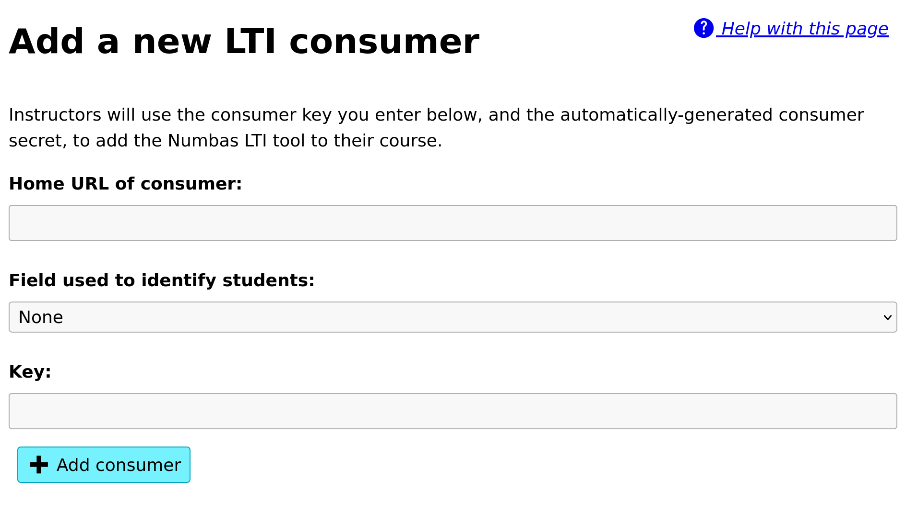
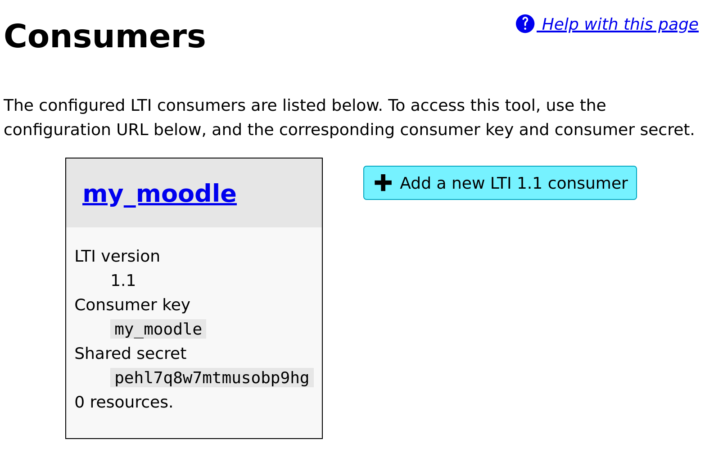

.. _add-lti-11-consumer:

Adding an LTI 1.1 consumer
##########################

LTI 1.1
*******

Click the :guilabel:`Add a new LTI 1.1 consumer` button.

You will be asked to give a unique _key_ to identify the consumer, and optionally the URL of the consumer's homepage.
The key can be any text, but should uniquely identify the consumer and its purpose.

    The "Add a consumer" screen.

Once you have created a consumer, you are shown its *key* and *shared secret*.
These are the pieces of information that the consumer will use to establish a secure connection with the Numbas LTI provider.

    The consumer management screen.

You must now set up the connection from the consumer's end.
There are instructions for some of the most popular VLEs below.

Blackboard Learn
================

Follow `Blackboard's instructions <https://en-us.help.blackboard.com/Learn/Administrator/SaaS/Integrations/Learning_Tools_Interoperability>`_ - you'll need to add Numbas as a new LTI Tool provider, and then add a placement for it. 

Blackboard doesn't support automatic configuration by URL, so you'll have to use the manual configuration settings.

For the tool provider, fill in the following values:

Provider domain
    Your launch URL.
Tool provider key
    Your consumer key.
Tool provider secret
    Your shared secret.

For the placement, fill in the following values:

Label
    "Numbas"
Type
    "Content Type", and select "Assessments" in the menu.
Placement allows grading
    Ticked.

Save the icon from your "Manage consumers" page and upload it under the **Icon** field on the Blackboard form.

You can now add a Numbas exam to any folder in Blackboard by selecting "Numbas" from the *Assignments* menu.

Moodle
======

Moodle from version 3.0 onwards supports LTI configuration by URL. 
Earlier versions require you to enter the configuration settings manually.

If you have administrator privileges on Moodle, you can add the tool as an activity type, so you don't have to enter the settings for each exam.

Moodle 3.0+
-----------

* Go to :guilabel:`Site administration` → :guilabel:`Plugins` → :guilabel:`Activity modules` → :guilabel:`External tool` → :guilabel:`Manage tools`.
* Paste your **automatic configuration URL** into the box labelled :guilabel:`Tool URL`, and click :guilabel:`Add Legacy LTI`.
* Enter your **consumer key** and **shared secret**, then click "*Save changes*".
* Go back to the :guilabel:`Manage tools` page and edit the Numbas tool. 
* For :guilabel:`Default launch container`, select "New window".
* If you'd like Numbas to show up as an activity type, bypassing the "External tool" step, for :guilabel:`Tool configuration usage`, select "Show in activity chooser and as a preconfigured tool".

Now you can add a Numbas exam in any course by clicking :guilabel:`Add an activity or resource` and selecting :guilabel:`External tool`, then select "Numbas" from the :guilabel:`Preconfigured tool` dropdown.

Versions of Moodle before 3.0
-----------------------------

* Go to :guilabel:`Site administration` → :guilabel:`Plugins` → :guilabel:`Activity modules` → :guilabel:`External tool` → :guilabel:`Manage tools`.
* Click on :guilabel:`Configure a tool manually`.
* Fill in the following values:

    Tool name
        "Numbas".
    Tool base URL
        Your launch URL.
    Consumer key
        Your consumer key.
    Shared secret
        Your shared secret.
* Under :guilabel:`Tool configuration usage`, select "Show in activity chooser and as a preconfigured tool".

Now you can add a Numbas exam in any course by clicking :guilabel:`Add an activity or resource` and selecting :guilabel:`Numbas`.

Canvas LMS
==========

* Go to your course's :guilabel:`Settings` page, then click on :guilabel:`Apps` and :guilabel:`View App Configurations`.
* Click the button to add an App.
* Fill in the following values:

    Configuration type
        "By URL".
    Consumer key
        Your consumer key.
    Shared secret
        Your shared secret.
    Config URL
        Your automatic configuration URL.

Now you can add a Numbas exam in your :guilabel:`Modules` page:

* Click the button to add an item.
* Select :guilabel:`External tool` and click on :guilabel:`Numbas`.
* Click :guilabel:`Add item`.

D2L BrightSpace
===============

.. note::

    These notes were based on a single installation performed in March 2022.

You must have the "Manage External Learning Tools Configuration" permission.

* In the :guilabel:`Admin Tools` menu, under :guilabel:`Organizational Tools`, click :guilabel:`External Learning Tools`.
* Switch to the :guilabel:`Manage External Learning Tool Links` tab.
* Click :guilabel:`New Link`.
* Fill in the following values:

    Title
        "Numbas".
    URL
        Your launch URL.
    Allow users to view this link
        Ticked
    Sign messages with key/secret with
        "Link key/secret"
    Key
        Your consumer key.
    Secret
        Your shared secret.
    Security settings
        Ensure the following are ticked:

        * "Send tool consumer information to tool provider"
        * "Send LTI user ID and LTI role list to tool provider"

        If you want to be able to identify students within the Numbas LTI tool, you should also tick:

        * "Send user name to tool provider"
        * "Send user email to tool provider"
* Click :guilabel:`Save and Close`.

Now you can add a Numbas exam in your :guilabel:`Modules` page:

* Click :guilabel:`Existing activities`.
* Select :guilabel:`External Learning Tools`.
* Select :guilabel:`Numbas`.
