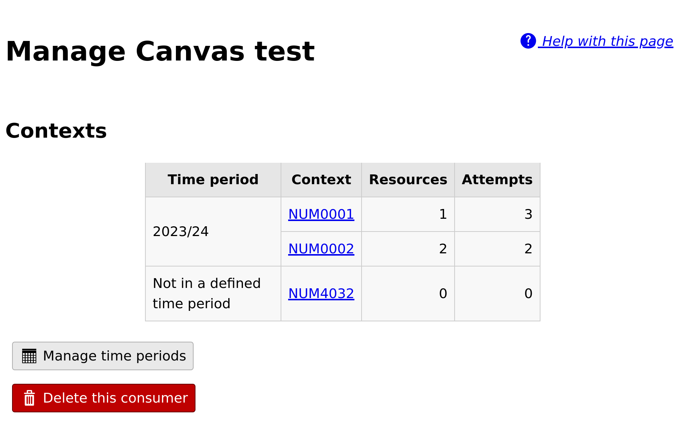
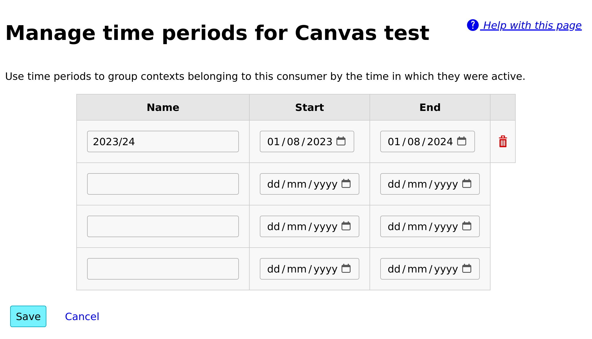

Managing a consumer
###################

Click on a consumer's name to see more detailed information about it.

ete this consumer".

    The consumer management view.

The management view lists all contexts provided by this consumer.
Contexts usually correspond to courses in a VLE - all :ref:`resources <resources>` launched from the same course will appear under the same context here.
Click on a context's name to see all resources in that context.

Time periods
************

Time periods allow you to group a consumer's contexts by when they were active.
You could use this to group contexts by academic year, for example.

Click on the :guilabel:`Manage time periods` button at the bottom of the consumer management page.
Each time period has a name and start and end dates.

    Managing time periods.

Each context is assigned to the latest time period containing the date on which the context's first resource was created.
If a context falls into a gap between non-overlapping time periods, it will be shown separately.

Time periods are used solely to group contexts in the display.
If you change or delete a time period, no data will be lost.

