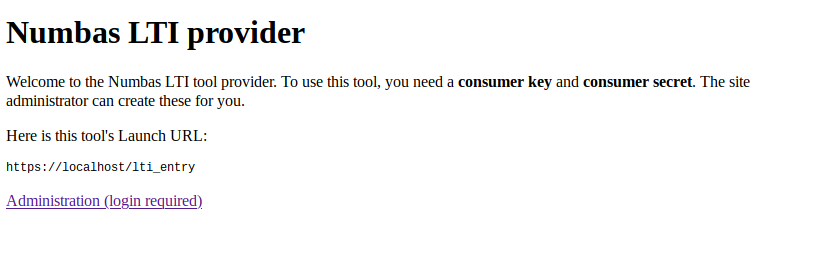
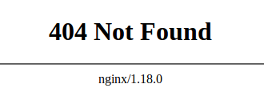

.. _installation-troubleshooting:

Troubleshooting
###############

This page collects a few common problems encountered after installing the Numbas LTI provider.

If the problem you're having doesn't have a solution on this page, please `file an issue on GitHub <https://github.com/numbas/numbas-lti-provider/issues>`_ or `email the Numbas team <mailto:numbas@ncl.ac.uk>`_.

JavaScript and stylesheets don't load
-------------------------------------

    The server welcome page has loaded without any stylesheets.

If the page looks like the above screenshot, with no stying applied to the text, it's possible that there's a problem serving static files.

Try the following:

* Collect the static files::

    cd /srv/numbas-lti-provider
    source /opt/numbas_lti_python/bin/activate
    python manage.py collectstatic --noinput
* Make sure the server can read the static files. On Ubuntu the web server runs as the user ``www-data``, while on RHEL it's ``nginx``::

    chown -R www-data:www-data /srv/numbas-lti-static
* On a system with SELinux, you may need to set it to premissive mode::

    setenforce Permissive
* If none of that works, open the browser's developer tools by pressing :kbd:`F12` and look in the :guilabel:`Network` tab for more information on any errors.

Generic NGINX 404 error page
----------------------------

    Nginx's "Not found" error page.

If you haven't set up a 502 error page (at :file:/srv/www/server-error/502.html` if you're following our instructions), it's likely that NGINX is really saying that it can't find a page to tell you about an error.

Have a look at the NGINX log, in :file:`/var/log/nginx/error.log`.

If you see something like "no live upstreams" or "Connection refused while connecting to upstream", check that the Numbas LTI :command:`daphne` and :command:`worker` processes are running::

    supervisorctl status

You should see something like the following::

    numbas_lti:numbas_lti_daphne_00    RUNNING   pid 1999, uptime 0:37:48
    numbas_lti:numbas_lti_daphne_01    RUNNING   pid 2000, uptime 0:37:48
    numbas_lti:numbas_lti_workers_00   RUNNING   pid 2001, uptime 0:37:48
    numbas_lti:numbas_lti_workers_01   RUNNING   pid 2002, uptime 0:37:48

Reporting scores back to the VLE fails
--------------------------------------

Check that the server running the LTI provider can make HTTPS requests to the address your VLE is accessed through.

If the connection always times out or there's an error making a connection, it may be the case that HTTPS connections are blocked.

If you get any other error, check that the Numbas LTI provider is reporting back to the right address. 
You can find the address used for a particular resource using the Django shell. First, find the ID of the :term:`resource` you're interested in - it's the numerical part of the address when you're looking at a resource's dashboard.

In a terminal, navigate to the Numbas LTI provider's directory and run the following (commands after ``>>>`` are Python code)::

    python manage.py shell
    >>> from numbas_lti.models import LTIUserData
    >>> resource_pk = 1 # Replace this with the ID of the resource you're interested in.
    >>> print(LTIUserData.objects.filter(resource__pk=resource_pk).first().lis_outcome_service_url)

Check with your VLE's documentation that this is the right address.
