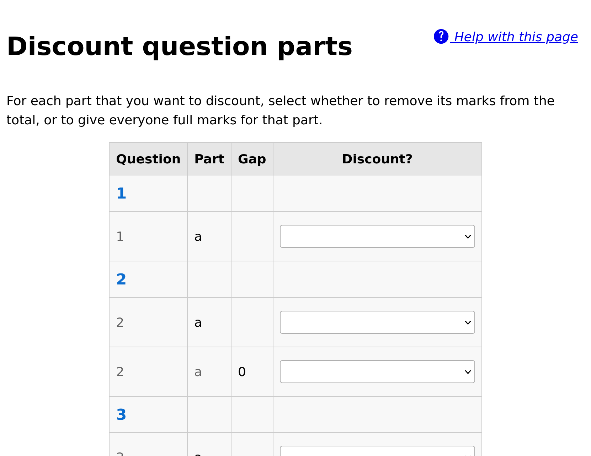
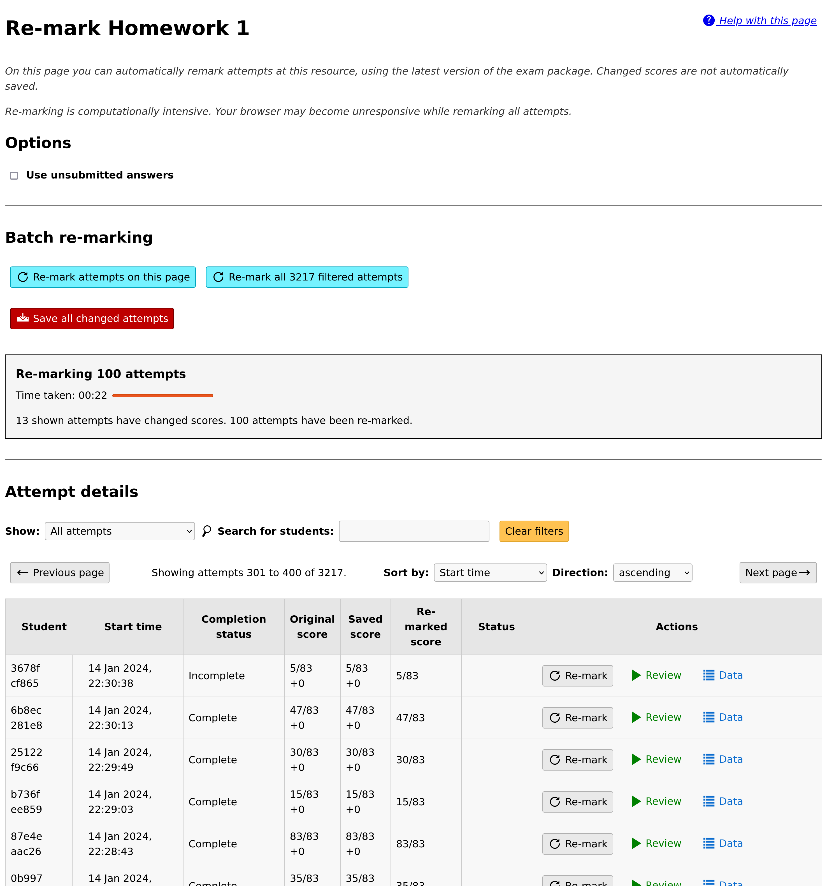

.. _resources:

Resources
#########

A *resource* is a single Numbas exam, which students access via the VLE.

Resources are automatically created when you launch a new Numbas activity from the VLE as an instructor.
You must select a Numbas exam to use, and then any students who launch the same activity will be shown the exam.

.. _create-resource:

Creating a new resource
-----------------------

.. figure:: _static/new_resource.png
    :alt: Form with options to upload a Numbas package, or select a ready-made exam.
    
    The first thing you see on creating a new Numbas resource.

Either upload an exam package that you have downloaded from the Numbas editor or, if any :term:`editor links <Editor link>` have been created, select an exam from the list.

When you :ref:`download an exam package <numbas:exam-admin-controls>` from the Numbas editor, you must use the :guilabel:`SCORM package` option.

Once you've selected an exam, you will be shown the dashboard for the resource.

Dashboard
---------

.. figure:: _static/dashboard.png

    The dashboard screen.

When you open a resource as an instructor, you are first shown the dashboard.
This view offers a few actions to do with the resource, and the navigation bar at the top has links to other views.

.. _report-scores:

Report scores back to VLE
^^^^^^^^^^^^^^^^^^^^^^^^^

The LTI provider can automatically report scores back to the VLE.

Click the :guilabel:`Report scores back to VLE` button to begin this process.
This may take some time; you'll be shown either a success message or any errors encountered while reporting scores.

This isn't supported by every VLE.

.. _discount-question-parts:

Discount question parts
^^^^^^^^^^^^^^^^^^^^^^^

Discounting a question part removes it from the score calculations: any marks students have earned for that part are discounted.

You might want to do this if an error is found in a question.

To discount a part, click on the :guilabel:`Discount a question part` button on the dashboard.

You are shown a list of all the question parts in the exam.
Click a :guilabel:`Discount this part` button next to a part to discount it.
You can choose whether to remove the part from the total available for the exam, or to award everyone full marks for the part.
These have different effects on the weighting of other parts in the exam - removing a part from the total will increase the weighting of other parts, while awarding full marks will increase everyone's total score.
Think carefully about what you want to do.

If you discount a gapfill part, all of its gaps are discounted.
If you discount an individual gap, the other gaps are unaffected.

    Discounting a question part.

.. _download-scores:

Download scores as CSV
^^^^^^^^^^^^^^^^^^^^^^

Click this button to download a ``.csv`` file containing the scores for each student who has attempt the resource.

The columns of the file are:

* First name
* Last name
* Email address
* Username
* Percentage score

The values in the name, email address and username fields come from the VLE.
The username field might not correspond exactly to the student's username on the VLE; in particular, Blackboard preprends usernames with ``cuid:``.

The file might take a while to produce; it'll be available in the :ref:`resource-reports` tab once it's ready.

Student progress
^^^^^^^^^^^^^^^^

From the dashboard, click :guilabel:`View individual student progress and grant access tokens` to view the :guilabel:`Student progress` table.

The :guilabel:`Student progress` table lists the names of students who have attempted the activity, along with their scores as calculated following the :ref:`grading method <grading-method>`, and the number of attempts they have made.

You can narrow down the displayed list by entering a name in the :guilabel:`Search for a student` box.

Note that only students who have launched the activity are listed - the LTI provider has no way of knowing about students who have access to the activity through the VLE but have never launched it.

.. _access-tokens:

Access tokens
^^^^^^^^^^^^^

When the number of attempts students are allowed to make is limited, circumstances can arise in which you want to allow particular students another attempt.

To do this, click the plus symbol in the :guilabel:`Access tokens` column next to the student's name in the :guilabel:`Student progress` table.

To revoke an access token, click the minus symbol next to the student's name in the :guilabel:`Access tokens` column.
Attempts started with an access token that is subsequently removed will not be deleted.

When the student launches the activity, they will be offered the opportunity to start a new attempt.

.. _validate-receipt:

Validate a receipt code
^^^^^^^^^^^^^^^^^^^^^^^

If enabled (see :ref:`email-receipts-option`), students are emailed a receipt on completion of an attempt.
The receipt contains information about their attempt, such as time and score, as well as a code that you can use to confirm that a receipt is valid.

On the :guilabel:`Validate a receipt code` page, copy a code from a student into a box.

If the code is valid, you'll be shown the information from the receipt, as well as a link to view the attempt's data in more detail.

.. figure:: _static/valid-receipt-code.png

   A validated receipt code.

If the code is invalid, or corresponds to an attempt at a different resource, you'll be told so.

.. figure:: _static/attempts.png

   An invalid receipt code.

Attempts
--------

Click on the :guilabel:`Attempts` button at the top of the page to view the attempt management screen.

.. figure:: _static/attempts.png

    The attempt management screen.

Download attempts summary as CSV
^^^^^^^^^^^^^^^^^^^^^^^^^^^^^^^^

Click the :guilabel:`Download attempts summary as CSV` button to obtain a ``.csv`` file with information on every attempt at this activity.

The columns of the file are:

* First name
* Last name
* Email address
* Username
* Start time, in ``YYYY-MM-DD HH:MM:SS.ffffff+HH:MM`` format.
* Completed? (Either ``completed`` or ``incomplete``)
* Total score
* Percentage (total score as a percentage of marks available)
* One column giving the total score for each question

The file might take a while to produce; it'll be available in the :ref:`resource-reports` tab once it's ready.

Download all attempt data as JSON
^^^^^^^^^^^^^^^^^^^^^^^^^^^^^^^^^

Click the :guilabel:`Download all attempt data as JSON` button to obtain a ``.json`` file containing all data to do with attempts on this resource, including part and question scores, all SCORM data, completion status, and the values of question variables.

The file might take a while to produce; it'll be available in the :ref:`resource-reports` tab once it's ready.

.. _review-attempt:

Review an attempt
^^^^^^^^^^^^^^^^^

Click the :guilabel:`Review` button to view a student's attempt as they saw it.

This is useful when a student queries the mark they were awarded for a part of the exam.

Note that review mode always opens attempts as if they were completed, even if the student has not yet ended the exam.

Remark an attempt
^^^^^^^^^^^^^^^^^

Click the :guilabel:`Remark` button to manually change the score awarded for a question part.

You are shown a list of every question part in the exam.
Click the pencil icon on the row corresponding to the part you want to change, and enter the new score.
The new score is saved as you type, and the totals for the question and the whole exam are recalculated automatically.

.. figure:: _static/remark-parts.png
    :alt: List of question parts. Part a gap 0 of question 1 has been discounted, and question 2 part a gap 0 has had its score manually set to 3.

    Remarking an attempt.

.. note::
   After updating the exam package associated with a resource, you can :ref:`automatically remark all attempts <auto-remark>` using the :guilabel:`Remark` tab.

.. _attempt-timeline:

Data
^^^^

By clicking on the :guilabel:`Data` button, you can see a timeline describing actions the student took during their attempt.

Items shown include moving between questions, submitting answers, and marks awarded.
This page will update in real-time as the student continues their attempt.

Click the :guilabel:`Download attempt data in JSON format` button to obtain a ``.json`` file containing all data pertaining to this attempt, including question and part scores, completion status, and the values of question variables.

Numbas uses the `SCORM <https://scorm.com/scorm-explained/>`_ standard to store data about attempts.
By clicking on the :guilabel:`View raw SCORM data for this attempt` button, you can see all of the SCORM data model elements stored for a particular attempt.

This is most useful for debugging connection errors, to confirm that data has been saved.

If :guilabel:`Most recent value only` is ticked, only the most recent value for each element is shown.
Untick it to see every value that the element has taken since the start of the attempt.

You can type a regular expression in the :guilabel:`Search for an element` box to narrow down the displayed list of elements.

Delete an attempt
^^^^^^^^^^^^^^^^^

Click the :guilabel:`Delete` button to delete an attempt.
This is permanent; the student will be able to start a new attempt next time they launch the activity.

Reopen an attempt
^^^^^^^^^^^^^^^^^

Sometimes students accidentally close their attempts before they mean to.
Click the :guilabel:`Reopen` button to allow a student to complete their attempt.
The next time that they launch the activity, they will be able to resume the attempt as if they had only paused it.

Beware that the standard Numbas settings allow a student to see the correct answers to every question once they have finished their attempt.
If you're concerned about this, it's often better to make the student start a new attempt, rather than reopen the previous one.

Statistics
----------

The :guilabel:`Statistics` page shows some statistics derived from attempts at this resource.

Attempt completion
^^^^^^^^^^^^^^^^^^

The :guilabel:`Attempt completion` table shows the completion status of attempts.
Don't worry if some attempts are still marked as "incomplete" after the deadline has passed - scores for incomplete attempts are still counted.

An attempt will have the status "Not attempted" if the student opened the resource, but did not click the "Start exam" button.
This can happen if the student's device has a problem which causes the exam not to load, or if it does load but they just don't start!

Summary statistics
^^^^^^^^^^^^^^^^^^

The :guilabel:`Summary statistics` table shows the mean, median and quartiles for some statistics about the resource.
The :guilabel:`Time taken` row is a rough measure of how long the student spent in their attempt; see :ref:`stat-time-spent` for more information.
Be careful when using this measurement: if a student completes their attempt in several sittings, the whole intervening time will be included, and even when a student has an attempt open, they might not be giving it their attention for the whole time.

Next is a breakdown of scores at each question, as a bar chart.
The attempts at each question are classified as "not attempted", "incorrect" (score 0), "partially correct", or "correct" (the maximum score for the question).

Score distribution
^^^^^^^^^^^^^^^^^^

The distribution of scores for the whole exam and for each question are shown as decreasing plots.
The horizontal axis represents percentage score, and the vertical axis represents the proportion of attempts achieving at least that score.

Attempt times
^^^^^^^^^^^^^^

Each attempt at the resource is shown as a span of time, with a dot at the recorded start time and another at the recorded end time.

.. _stat-time-spent:

Time spent
^^^^^^^^^^

The distribution of time spent at attempts is shown as a decreasing plot.
The horizontal axis represents lengths of time, and the vertical axis represents the proportion of attempts at least that long.

The 'time spent' is a rough measure of how long the student spent in their attempt.
This time is increased each time attempt data is saved, based on the time since their current session started.
It is not simply the difference between the start and end times: if the student closes their attempt for a long time and then resumes it later, the time that it was closed is not counted.

Be careful when interpreting this measurement: students might leave an attempt open while they do something else, so there are often large outliers.

Settings
-----------------

.. figure:: _static/settings.png

    The resource settings screen.

Replace exam package
^^^^^^^^^^^^^^^^^^^^

If you discover an error in your exam, you can update it by downloading it again from the editor and clicking the :guilabel:`Replace exam package` button.

Any new attempts will use the latest version of the exam package.
Because the new version might have changed in a way that is incompatible with existing attempts, for example by removing or rearranging question parts, any attempts started with the old package will by default continue to use the old package.
If you know that the new package is compatible with the old one, for example if you've just corrected some text or fixed a bug in some code rather than changing the structure of the exam, tick :guilabel:`Make existing attempts use this version`.
All attempts using the old package will be updated to use the new one.

If the new version of the exam fixes problems with marking, you can try :ref:`automatically remarking existing attempts <auto-remark>`.

.. _grading-method:

Grading method
^^^^^^^^^^^^^^

Specify how a student's score for the activity is calculated.

* "Highest score" will use the highest total score from any of the student's attempts.
* "Last attempt" will use the total score from the attempt which the student began last.

Include incomplete attempts in grading?
^^^^^^^^^^^^^^^^^^^^^^^^^^^^^^^^^^^^^^^

If ticked, incomplete attempts will be included when calculating the student's score for the activity.

It's normally good to leave this on, so that students who forget to click the :guilabel:`End Exam` button won't be penalised.

.. _maximum-attempts:

Maximum attempts per user
^^^^^^^^^^^^^^^^^^^^^^^^^

How many :term:`attempts <Attempt>` at the resource can each user take?

If set to 0, then there is no limit.

You can grant extra attempts to individual students with :ref:`access tokens <access-tokens>`.

.. _when-to-show-scores:

When to show scores to students
^^^^^^^^^^^^^^^^^^^^^^^^^^^^^^^

When a student reopens an activity, they are shown a summary of their attempts.
You might not want to immediately show students their scores on this screen.

* "Always" means the student will see scores for all attempts, including incomplete attempts.
* "When attempt is complete" means the student will only see their score for an attempt once it is complete.
* "When review is allowed" means the student will only see their score after the date specified in the :ref:`allow-students-to-review-attempts-from` setting.
* "Never" means that no scores are shown to the student, even after they've completed their attempt.

.. warning::
    This only controls the display of scores by the LTI provider.
    If you want to hide scores from the students, you must also turn off the score feedback options in the exam editor.

.. _when-to-report-scores-back:

When to report scores back
^^^^^^^^^^^^^^^^^^^^^^^^^^

Specify when students' scores are reported back to the :term:`consumer <Tool consumer>`.
Some VLEs make reported scores available to students immediately, which you may not want.

* "Immediately" - scores are reported as soon as they change, i.e. whenever a student submits an answer.
* "On completion" - a student's score is reported when they complete an attempt.
* "Manually, by instructor" - Scores are only reported when an instructor clicks the :guilabel:`Report scores back to VLE` button on the dashboard.

.. _allow-students-to-review-attempts-from:

Allow students to review attempts from
^^^^^^^^^^^^^^^^^^^^^^^^^^^^^^^^^^^^^^

Specify when students are allowed to re-enter completed attempts in review mode.

If left blank, students can review their attempts at any time.

If a date and time are set, students may only review their attempts after that time.

Instructors may always review students' attempts, from the :guilabel:`Attempts` tab.

.. _availability:

Available from and available until
^^^^^^^^^^^^^^^^^^^^^^^^^^^^^^^^^^

Specify when students are allowed to access the resource.

You can set none, one or both of the options :guilabel:`Available from` and :guilabel:`Available until`.

If :guilabel:`Available from` is before :guilabel:`Available until`, the resource will be available only between those two times.
Use this for a resource which should only be available for a certain period, such as an exam.

If :guilabel:`Available from` is after :guilabel:`Available until`, the resource will be *unavailable* between those two times, but available any time before :guilabel:`Available until` and any time after :guilabel:`Available from`.
Use this for a resource which should be made unavailable for a certain period, such as a bank of practice material which students should not have access to during a summative assessment period.

Any students who have the resource open when it becomes unavailable will be forced to quit.

.. _email-receipts-option:

Email attempt receipts to students on completion?
^^^^^^^^^^^^^^^^^^^^^^^^^^^^^^^^^^^^^^^^^^^^^^^^^

If ticked, then when a student completes an attempt at this resource they will be emailed a receipt summarising their attempt.

The receipt contains a code which instructors can use to confirm the receipt's contents.
See :ref:`validate-receipt`.

.. _require-lockdown-app:

Require a lockdown app?
^^^^^^^^^^^^^^^^^^^^^^^

You can require that students access this resource through the Numbas lockdown app or, if configured, Safe Exam Browser.
See :ref:`the documentation on lockdown-apps <lockdown-apps>`.

If you select :guilabel:`Numbas lockdown app`, you can give a password that the student must submit to launch the resource, or leave the field empty to use the LTI provider's default password.

If you select :guilabel:`Safe Exam Browser`, you must select a settings file to use; these must be installed by a server administrator.

Whichever app you use, you can choose whether or not to show the password to the student before the app launches.

When a student launches a resource requiring a lockdown app, they will be shown a button to launch the app, along with a link to install it if they haven't already.

   This is what a student sees when they launch a resource which requires the Numbas lockdown app.

.. raw:: html

    <iframe src="https://player.vimeo.com/video/778056290?h=18a23970ca" width="640" height="564" frameborder="0" allow="autoplay; fullscreen" allowfullscreen></iframe>

.. _auto-remark:

Remark
------

    
    Remarking a resource.

The :guilabel:`Remark` tab provides an interface for automatically re-running attempts at the resource using the latest version of the exam package.
If the total score awarded for an attempt is different to the saved score, you can overwrite it.

When the page loads, you are shown all attempts at the resource.
You can remark individual attempts, or remark all the attempts automatically.

.. note::

    Remarking an exam is computationally intensive, so your browser may appear unresponsive.

If :guilabel:`Use unsubmitted answers` is ticked, then any answers entered by the student but not submitted will be considered to be submitted.
You can use this in cases where a student forgot to submit their answers and you want to have them marked anyway.

After you click :guilabel:`Remark all attempts`, each attempt will be remarked in turn.
A progress bar shows the proportion of attempts that have been remarked, and an estimated time until completion.

To stop the process of remarking all attempts, click :guilabel:`Stop marking`.
If an attempt is currently being remarked, it can't be interrupted - the process will stop after that attempt is finished.

You can choose to :guilabel:`Show` all attempts, only attempts with changed scores, or only attempts with either increased or decreased scores.

When one or more attempts have been remarked and produced different scores, the :guilabel:`Save all changed attempts` button becomes available.
After clicking this button, any changed data corresponding to the shown attempts is saved to the database.
This data will appear in the :ref:`timeline for the attempt <attempt-timeline>` and will affect the reported scores for the attempt.

Each attempt has its own :guilabel:`Remark` button, which will remark only that attempt.
When an attempt has been remarked, the change in total score is shown.
If the total score is different to that stored in the database, a :guilabel:`Save` button appears.
Clicking the button causes changed data corresponding to the attempt to be saved to the database, updating its timeline and reported score.

Access changes
--------------

*Access changes* are a means of changing deadlines or allowing a different number of attempts at the resource to certain students.

Each access change applies to a list of students.

To create an access change, click on the :guilabel:`Access changes` tab, then :guilabel:`Add an access change`.

There are several fields that you can modify.
Leave a field entirely blank to keep the standard value from the resource's settings.

In the :guilabel:`Description` field, describe what the access change is for and who it applies to, such as "25% extra time", or "Late submission for Elliot D".

Access changes take effect immediately.
Any students who are completing an attempt at the time that their access changes will receive the new details immediately.
If the resource becomes unavailable for them, the attempt will end immediately.
Otherwise, a message will appear on their screen describing the new deadline.

Availability dates
^^^^^^^^^^^^^^^^^^

The fields in the :guilabel:`Availability dates` section change the time period in which the affected students can complete attempts at the resource.
You can either set new fixed start and end dates, or fill in the :guilabel:`Extend the deadline by` field to extend the resource's normal :guilabel:`Available from` date.

If several access changes apply to a student, the changes from the last created access change are used.

Exam duration
^^^^^^^^^^^^^

If the exam associated with the resource has a duration set, then you can extend it, either by an absolute length of time or by a percentage of the standard duration.

If several access changes apply to a student, the change in the last created access change is used.

Number of attempts
^^^^^^^^^^^^^^^^^^

The :guilabel:`Maximum attempts per user` field overrides the resource's :ref:`maximum-attempts` field.

The student is allowed whichever is the greatest of the resource's normal maximum number of attempts and the numbers specified by any access changes affecting the student.

A value of zero in this field does not mean "no change", it means that the affected students are allowed to start as many attempts as they like.

Applies to
^^^^^^^^^^

Specify which students the access change applies to by giving lists of usernames or email addresses.
These are compared with the usernames and email addresses sent by the LTI consumer.

.. warning::

    Note that the LTI consumer can choose what it send for these fields, so they might not match the values you use in other systems.
    The access change form shows the username and email address it received from the LTI consumer for your account, as a guide.

.. _resource-reports:

Reports
-------

When you ask to download one of the resource-level reports, it's compiled in the background.
Once it's ready, you can download it from the :guilabel:`Reports` tab.

Reports are automatically deleted after a fixed period of time set by the administrator; the default is 30 days.

Test run
--------

Click the :guilabel:`Test run` button to launch the Numbas exam.
Data will not be saved - this feature is solely a convenience for instructors to check the contents of the exam.
