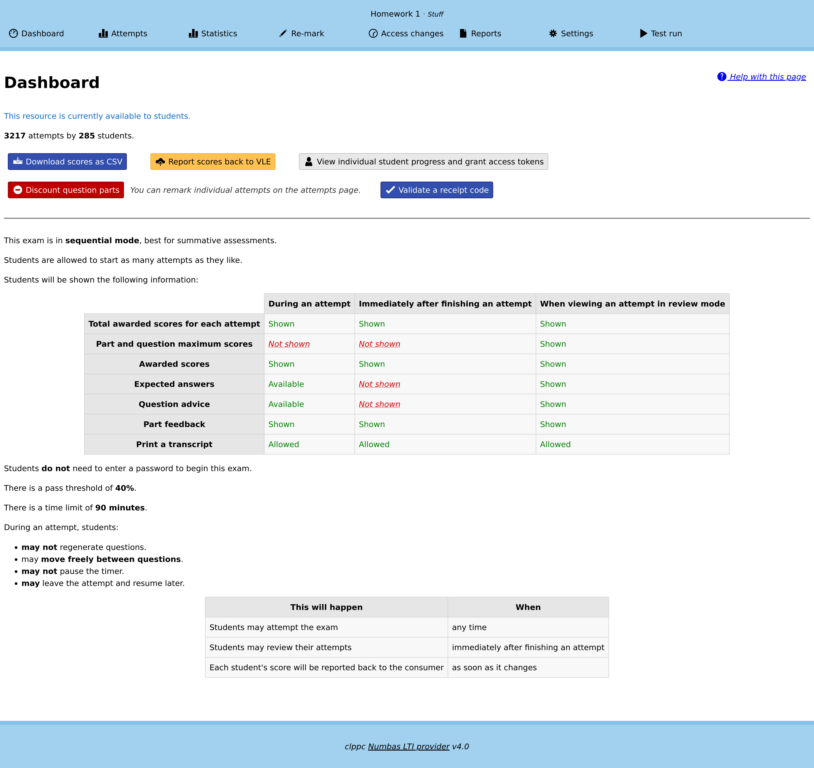

.. _resources:

Resources
#########

A *resource* is a single Numbas exam, which students access via the VLE.

Resources are automatically created when you launch a new Numbas activity from the VLE as an instructor.
You must select a Numbas exam to use, and then any students who launch the same activity will be shown the exam.

.. _create-resource:

Creating a new resource
-----------------------

.. figure:: _static/new_resource.png
    :alt: Form with options to upload a Numbas package, or select a ready-made exam.
    
    The first thing you see on creating a new Numbas resource.

Either upload an exam package that you have downloaded from the Numbas editor or, if any :term:`editor links <Editor link>` have been created, select an exam from the list.

When you :numbas:ref:`download an exam package <exam-admin-controls>` from the Numbas editor, you must use the :guilabel:`SCORM package` option.

Once you've selected an exam, you will be shown the dashboard for the resource.

Dashboard
---------

    The dashboard screen.

When you open a resource as an instructor, you are first shown the dashboard.
This view offers a few actions to do with the resource, and the navigation bar at the top has links to other views.

.. _report-scores:

Report scores back to VLE
^^^^^^^^^^^^^^^^^^^^^^^^^

The LTI provider can automatically report scores back to the VLE.

Click the :guilabel:`Report scores back to VLE` button to begin this process.
This may take some time; you'll be shown either a success message or any errors encountered while reporting scores.

This isn't supported by every VLE.

.. _discount-question-parts:

Discount question parts
^^^^^^^^^^^^^^^^^^^^^^^

Discounting a question part removes it from the score calculations: any marks students have earned for that part are discounted.

You might want to do this if an error is found in a question.

To discount a part, click on the :guilabel:`Discount a question part` button on the dashboard.

You are shown a list of all the question parts in the exam.
Click a :guilabel:`Discount this part` button next to a part to discount it.
You can choose whether to remove the part from the total available for the exam, or to award everyone full marks for the part.
These have different effects on the weighting of other parts in the exam - removing a part from the total will increase the weighting of other parts, while awarding full marks will increase everyone's total score.
Think carefully about what you want to do.

If you discount a gapfill part, all of its gaps are discounted.
If you discount an individual gap, the other gaps are unaffected.

.. figure:: _static/discount-parts.png
    :alt: List of question parts. Part a has been discounted.

    Discounting a question part.

.. _download-scores:

Download scores as CSV
^^^^^^^^^^^^^^^^^^^^^^

Click this button to download a ``.csv`` file containing the scores for each student who has attempt the resource.

The columns of the file are:

* First name
* Last name
* Email address
* Username
* Percentage score

The values in the name, email address and username fields come from the VLE.
The username field might not correspond exactly to the student's username on the VLE; in particular, Blackboard preprends usernames with ``cuid:``.

Student progress
^^^^^^^^^^^^^^^^

From the dashboard, click :guilabel:`View individual student progress and grant access tokens` to view the :guilabel:`Student progress` table.

The :guilabel:`Student progress` table lists the names of students who have attempted the activity, along with their scores as calculated following the :ref:`grading method <grading-method>`, and the number of attempts they have made.

You can narrow down the displayed list by entering a name in the :guilabel:`Search for a student` box.

Note that only students who have launched the activity are listed - the LTI provider has no way of knowing about students who have access to the activity through the VLE but have never launched it.

.. _access-tokens:

Access tokens
^^^^^^^^^^^^^

When the number of attempts students are allowed to make is limited, circumstances can arise in which you want to allow particular students another attempt.

To do this, click the plus symbol in the :guilabel:`Access tokens` column next to the student's name in the :guilabel:`Student progress` table.

To revoke an access token, click the minus symbol next to the student's name in the :guilabel:`Access tokens` column. 
Attempts started with an access token that is subsequently removed will not be deleted.

When the student launches the activity, they will be offered the opportunity to start a new attempt.

.. _validate-receipt:

Validate a receipt code
^^^^^^^^^^^^^^^^^^^^^^^

If enabled (see :ref:`email-receipts-option`), students are emailed a receipt on completion of an attempt.
The receipt contains information about their attempt, such as time and score, as well as a code that you can use to confirm that a receipt is valid.

On the :guilabel:`Validate a receipt code` page, copy a code from a student into a box.

If the code is valid, you'll be shown the information from the receipt, as well as a link to view the attempt's data in more detail.

.. figure:: _static/valid-receipt-code.png

   A validated receipt code.

If the code is invalid, or corresponds to an attempt at a different resource, you'll be told so.

   An invalid receipt code.

Attempts
--------

Click on the :guilabel:`Attempts` button at the top of the page to view the attempt management screen.

    The attempt management screen.

Download attempts summary as CSV
^^^^^^^^^^^^^^^^^^^^^^^^^^^^^^^^

Click the :guilabel:`Download attempts summary as CSV` button to obtain a ``.csv`` file with information on every attempt at this activity.

The columns of the file are:

* First name
* Last name
* Email address
* Username
* Start time, in ``YYYY-MM-DD HH:MM:SS.ffffff+HH:MM`` format.
* Completed? (Either ``completed`` or ``incomplete``)
* Total score
* Percentage (total score as a percentage of marks available)
* One column giving the total score for each question

Download all attempt data as JSON
^^^^^^^^^^^^^^^^^^^^^^^^^^^^^^^^^

Click the :guilabel:`Download all attempt data as JSON` button to obtain a ``.json`` file containing all data to do with attempts on this resource, including part and question scores, all SCORM data, completion status, and the values of question variables.

.. _review-attempt:

Review an attempt
^^^^^^^^^^^^^^^^^

Click the :guilabel:`Review` button to view a student's attempt as they saw it.

This is useful when a student queries the mark they were awarded for a part of the exam.

Note that review mode always opens attempts as if they were completed, even if the student has not yet ended the exam.

Remark an attempt
^^^^^^^^^^^^^^^^^

Click the :guilabel:`Remark` button to manually change the score awarded for a question part.

You are shown a list of every question part in the exam.
Click the pencil icon on the row corresponding to the part you want to change, and enter the new score.
The new score is saved as you type, and the totals for the question and the whole exam are recalculated automatically.

    Remarking an attempt.

Data
^^^^

By clicking on the :guilabel:`Data` button, you can see a timeline describing actions the student took during their attempt.

Items shown include moving between questions, submitting answers, and marks awarded.
This page will update in real-time as the student continues their attempt.

Click the :guilabel:`Download attempt data in JSON format` button to obtain a ``.json`` file containing all data pertaining to this attempt, including question and part scores, completion status, and the values of question variables.

Numbas uses the `SCORM <https://scorm.com/scorm-explained/>`_ standard to store data about attempts.
By clicking on the :guilabel:`View raw SCORM data for this attempt` button, you can see all of the SCORM data model elements stored for a particular attempt.

This is most useful for debugging connection errors, to confirm that data has been saved.

If :guilabel:`Most recent value only` is ticked, only the most recent value for each element is shown.
Untick it to see every value that the element has taken since the start of the attempt.

You can type a regular expression in the :guilabel:`Search for an element` box to narrow down the displayed list of elements.

Delete an attempt
^^^^^^^^^^^^^^^^^

Click the :guilabel:`Delete` button to delete an attempt.
This is permanent; the student will be able to start a new attempt next time they launch the activity.

Reopen an attempt
^^^^^^^^^^^^^^^^^

Sometimes students accidentally close their attempts before they mean to.
Click the :guilabel:`Reopen` button to allow a student to complete their attempt.
The next time that they launch the activity, they will be able to resume the attempt as if they had only paused it.

Beware that the standard Numbas settings allow a student to see the correct answers to every question once they have finished their attempt.
If you're concerned about this, it's often better to make the student start a new attempt, rather than reopen the previous one.

Settings
-----------------

.. figure:: _static/settings.png

    The resource settings screen.

Replace exam package
^^^^^^^^^^^^^^^^^^^^

If you discover an error in your exam, you can update it by downloading it again from the editor and clicking the :guilabel:`Replace exam package` button.

Any new attempts will use the latest version of the exam package.
Because the new version might have changed in a way that is incompatible with existing attempts, for example by removing or rearranging question parts, any attempts started with the old package will continue to use the old package.

.. _grading-method:

Grading method
^^^^^^^^^^^^^^

Specify how a student's score for the activity is calculated.

* "Highest score" will use the highest total score from any of the student's attempts.
* "Last attempt" will use the total score from the attempt which the student began last.

Include incomplete attempts in grading?
^^^^^^^^^^^^^^^^^^^^^^^^^^^^^^^^^^^^^^^

If ticked, incomplete attempts will be included when calculating the student's score for the activity.

It's normally good to leave this on, so that students who forget to click the :guilabel:`End Exam` button won't be penalised.

.. _maximum-attempts:

Maximum attempts per user
^^^^^^^^^^^^^^^^^^^^^^^^^

How many :term:`attempts <Attempt>` at the resource can each user take?

If set to 0, then there is no limit.

You can grant extra attempts to individual students with :ref:`access tokens <access-tokens>`.

.. _when-to-show-scores:

When to show scores to students
^^^^^^^^^^^^^^^^^^^^^^^^^^^^^^^

When a student reopens an activity, they are shown a summary of their attempts.
You might not want to immediately show students their scores on this screen.

* "Always" means the student will see scores for all attempts, including incomplete attempts.
* "When attempt is complete" means the student will only see their score for an attempt once it is complete.
* "When review is allowed" means the student will only see their score after the date specified in the :ref:`allow-students-to-review-attempts-from` setting.
* "Never" means that no scores are shown to the student, even after they've completed their attempt.

.. warning::
    This only controls the display of scores by the LTI provider.
    If you want to hide scores from the students, you must also turn off the score feedback options in the exam editor.

.. _when-to-report-scores-back:

When to report scores back
^^^^^^^^^^^^^^^^^^^^^^^^^^

Specify when students' scores are reported back to the :term:`consumer <Tool consumer>`.
Some VLEs make reported scores available to students immediately, which you may not want.

* "Immediately" - scores are reported as soon as they change, i.e. whenever a student submits an answer.
* "On completion" - a student's score is reported when they complete an attempt.
* "Manually, by instructor" - Scores are only reported when an instructor clicks the :guilabel:`Report scores back to VLE` button on the dashboard.

.. _allow-students-to-review-attempts-from:

Allow students to review attempts from
^^^^^^^^^^^^^^^^^^^^^^^^^^^^^^^^^^^^^^

Specify when students are allowed to re-enter completed attempts in review mode.

If left blank, students can review their attempts at any time.

If a date and time are set, students may only review their attempts after that time.

Instructors may always review students' attempts, from the :guilabel:`Attempts` tab.

.. _email-receipts-option:

Email attempt receipts to students on completion?
^^^^^^^^^^^^^^^^^^^^^^^^^^^^^^^^^^^^^^^^^^^^^^^^^

If ticked, then when a student completes an attempt at this resource they will be emailed a receipt summarising their attempt.

The receipt contains a code which instructors can use to confirm the receipt's contents. See :ref:`validate-receipt`.

Test run
--------

Click the :guilabel:`Test run` button to launch the Numbas exam.
Data will not be saved - this feature is solely a convenience for instructors to check the contents of the exam.
