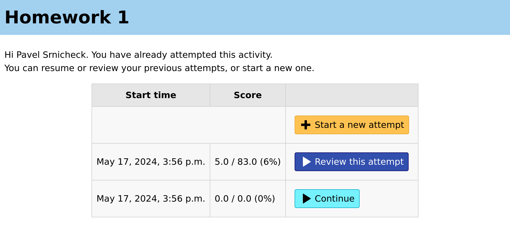

For students
============

When you clicks on a link to launch a Numbas :ref:`activity <resources>` for the first time, you are taken straight into the exam.

Your answers and scores are saved as soon as they are submitted.

.. warning::
    
    Unsubmitted answers are saved but not marked, so you will not receive any marks for answers not submitted before a resource's deadline.
    The automatic re-marking tool can mark unsubmitted answers, if necessary.
    Numbas allows students to submit answers as many times as they like, with no penalty, so encourage them to submit as soon as they've entered an answer.

If you leave the test before completing it, you will be able to resume from where you left off the next time you return.

On subsequent launches of the activity, you are shown a summary of your attempts.
If :ref:`the exam's settings <when-to-show-scores>` allow it, the score earned for each attempt is shown.

You can click the :guilabel:`Continue` button to resume an incomplete attempt where you left off.

Once you click the :guilabel:`End exam` button, the attempt is marked as "completed", and you can not change your answers.
If the server is configured to do it, you are emailed a receipt containing information about your attempt, and a code that can be used by the instructor to :ref:`validate it <validate-receipt>`.

For completed attempts, you can click :guilabel:`Review this attempt` to reopen the attempt in review mode, the same as was shown when you ended the exam.
Depending on the instructor's settings, further feedback may be made available when you reopen an attempt in review mode.
You will see the results summary screen, and can click on individual questions to see their answers and any feedback.

If :ref:`the exam's settings <maximum-attempts>` allow it, or you have an unused :ref:`access token <access-tokens>`, you can start a new attempt by clicking the :guilabel:`Start a new attempt` button.

    The attempt summary screen shown to a student.
    
